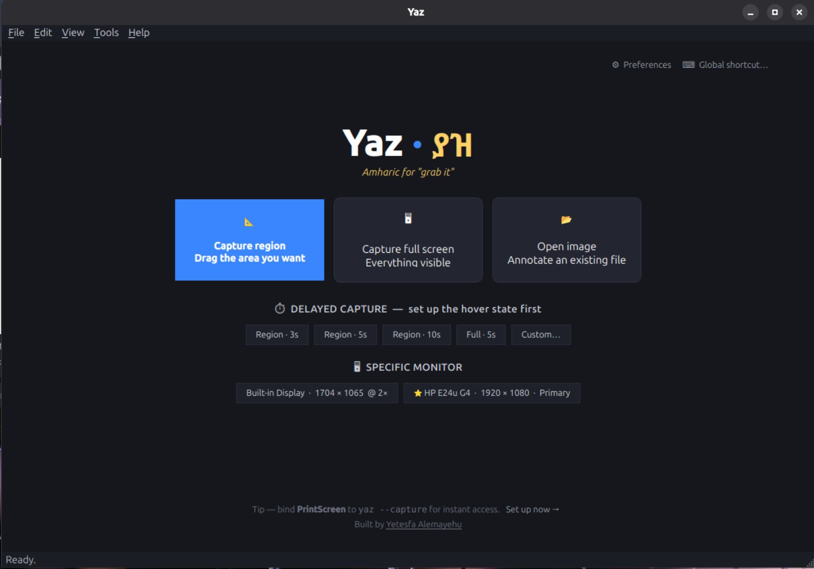

<div align="center">

# Yaz · ያዝ

**A Wayland-native screenshot and annotation tool for Linux.**
*ያዝ — Amharic for "grab it".*

[](LICENSE)
[]()
[]()
[]()
[]()



</div>

---

## Why Yaz

Most "Linux screenshot tools" don't work on **GNOME Wayland** — the default
session in Ubuntu 24.04+ and Fedora Workstation:

- **Flameshot**, **Shutter**, **Spectacle** — built for X11 or wlroots.
  They open but their capture fails silently or returns an empty image.
- **grim / slurp** — require `wlr-screencopy`, which Mutter (GNOME's
  compositor) doesn't implement.
- **`org.gnome.Shell.Screenshot` D-Bus API** — locked down for
  unsandboxed apps in GNOME 46+.
- **gnome-screenshot** — captures the screen, but ships no annotation
  editor.

Yaz fills the gap. It captures via the path that *actually works* on each
session (gnome-screenshot → grim → xdg-desktop-portal), and gives you a
full annotation editor that feels like Flameshot's, on top.

It also handles the part everyone gets wrong: **mixed-DPR multi-monitor
setups with fractional scaling**, like a HiDPI laptop paired with a 1×
external display.

---

## Install

### Option A — Direct `.deb` (Ubuntu / Debian / Pop!_OS)

```bash
wget https://github.com/yetesfa/yaz/releases/latest/download/yaz_0.1.0_all.deb
sudo apt install ./yaz_0.1.0_all.deb
```

The `.deb` is ≈26 KB and pulls in `python3-pyqt6`, `python3-gi`,
`gnome-screenshot`, and `wl-clipboard` automatically.

### Option B — `apt install` via Launchpad PPA *(coming soon)*

```bash
sudo add-apt-repository ppa:yetesfa/yaz
sudo apt update
sudo apt install yaz
```

### Option C — Snap (Ubuntu App Center) *(coming soon)*

```bash
sudo snap install yaz
```

### Option D — From source

```bash
git clone https://github.com/yetesfa/yaz.git
cd yaz
./install.sh
```

The installer:
- runs `sudo apt install` for the four required system packages
  (one password prompt)
- creates an isolated `.venv/` with `PyQt6` inside the repo
- symlinks `yaz` → `~/.local/bin/yaz`
- installs a `.desktop` entry with quick-action menu items

Run with `yaz` from any terminal, or launch **Yaz** from the apps grid.

> **Other distros**: Yaz works on any Linux with Python 3.10+, PyQt6, and
> a Wayland/X11 session that runs `xdg-desktop-portal`. The launcher and
> `yaz.py` are portable; you'll need to map the apt packages to your
> distro's equivalents. See [PACKAGING.md](PACKAGING.md) for build paths.

---

## Features

### Capture

| | What it does |
|---|---|
| 📐 **Region** | Drag a rectangle on a dimmed full-screen overlay. Size badge shows live `W × H`. `Enter` for full-screen; `Esc` to cancel. |
| 🖥 **Full screen** | Capture the entire virtual desktop (every monitor combined). |
| 🖥 **Specific monitor** | Per-display capture with **correct cropping** even on mixed-DPR + fractional-scaling setups. Auto-labelled (e.g. *"HP E24u G4"*, *"Built-in Display"*). |
| ⏱ **Delayed** | 3 / 5 / 10 second or custom delay with a floating countdown. Lets you set up hover-state screenshots cleanly. |

### Annotate

The editor opens immediately with the captured image. Tools:

- **Select** — click to grab an annotation, drag to move, Delete to remove
- **Crop** — drag a rectangle to crop the image (undoable)
- **Rectangle / Ellipse** — outline or fill, configurable stroke width
- **Arrow** — auto-drawn arrowhead at the destination
- **Line** — straight line between two points
- **Pen** — freehand drawing
- **Highlighter** — semi-transparent thick stroke (overlays content)
- **Text** — prompted text annotation with size scaled by stroke width
- **Blur** — pixelate a region (no extra dependencies)

### Edit

- **Full undo/redo** for every change: add, delete, move, crop, blur,
  property tweaks
- **Live property edits** — select any annotation and change its
  Width or Color in the toolbar; the change applies live
- **Z-order** — Bring to Front / Send to Back via the right-click menu
- **Select All** annotations / **Clear All** with one action
- **Zoom** — `Ctrl + Scroll`, `Ctrl++`, `Ctrl+-`, `Ctrl+0`, `Ctrl+F`

### Output

- **Save** PNG or JPEG to your configured folder with a strftime
  filename template
- **Save As…** for one-off paths
- **Copy to clipboard** via both `QClipboard` (Qt apps) and `wl-copy`
  (Wayland-native, works with Chromium/Firefox/Slack etc.)

### Workflow

- **Welcome screen** with one-click capture options — no need to learn
  CLI flags
- **Menu bar** (File / Edit / View / Tools / Help) with every action
- **Preferences** — save folder, filename template, format, JPG quality,
  default delay, default color, default stroke width, default fill,
  toolbar/statusbar visibility
- **Global keyboard-shortcut wizard** — `File → Set Up Global Keyboard
  Shortcut…` writes a GNOME custom keybinding so `Ctrl+Shift+Print`
  (or your choice) triggers Yaz from any app, including browsers

---

## Usage

### Quick capture from anywhere

```bash
yaz --capture       # region picker, then edit
yaz --full          # full screen, then edit
yaz --capture --delay 5    # 5-second timer, then region picker
yaz --open shot.png        # open existing image to annotate
```

### Hover screenshots (the trick that's hard with other tools)

1. Open Yaz.
2. Click **Region · 5s** on the welcome screen (or pick **File → New
   Capture → Capture Region with Delay → 5 seconds**).
3. Yaz minimises. A floating countdown appears in the top-right
   (`5 → 4 → 3 → 2 → 1`).
4. Hover the button / open the menu / trigger the dropdown you want to
   capture.
5. At 0, Yaz captures the screen and shows you the region picker over
   the captured image.
6. Drag the region containing the hover state. Edit.

### Editing existing annotations

1. Switch to the **Select** tool (`V`).
2. Click an annotation (drag-select multiple if you want).
3. Change **Width** in the toolbar — every selected item updates live.
4. Click the **Color** swatch — pick a new colour — every selected
   item recolours live (fills follow the stroke).
5. Right-click for **Delete**, **Bring to Front**, **Send to Back**,
   **Change color…**, **Change width…**.

### Multi-monitor capture

The welcome screen shows one button per monitor, ordered left-to-right
by physical position, with a ⭐ on the primary. Each button shows the
monitor's resolution and scale (`Built-in Display · 1704 × 1065 @ 2×`).

Yaz figures out **where** each monitor's pixels live in the captured
virtual-desktop image — see *How it works* below.

---

## Keyboard shortcuts

| Key | Action |
|---|---|
| `Ctrl+R` | Capture region |
| `Ctrl+Alt+R` | Capture full screen |
| `Ctrl+Shift+3` / `5` / `0` | Capture region after 3 / 5 / 10 seconds |
| `Ctrl+O` | Open existing image |
| `Ctrl+S` | Save (to default folder + filename template) |
| `Ctrl+Shift+S` | Save As… |
| `Ctrl+Shift+C` | Copy image to clipboard |
| `Ctrl+W` | Close current image (back to welcome) |
| `Ctrl+,` | Preferences |
| `V` | Select / move tool |
| `C` | Crop tool |
| `R` | Rectangle |
| `E` | Ellipse |
| `A` | Arrow |
| `L` | Line |
| `P` | Pen (freehand) |
| `H` | Highlighter |
| `T` | Text |
| `B` | Blur / pixelate |
| `Shift+F` | Toggle fill on rectangles / ellipses |
| `Ctrl+Z` / `Ctrl+Y` | Undo / Redo |
| `Delete` | Delete selected annotations |
| `Ctrl+A` | Select all annotations |
| `Ctrl++` / `Ctrl+-` / `Ctrl+0` / `Ctrl+F` | Zoom in / out / reset / fit |
| `Ctrl + Scroll` | Smooth zoom |

> These shortcuts fire only when Yaz is the focused application. For a
> system-wide shortcut (e.g. `PrintScreen` from inside a browser), use
> **File → Set Up Global Keyboard Shortcut…**

---

## Configuration

Open **File → Preferences** (`Ctrl+,`) to customise:

| Setting | Default | Notes |
|---|---|---|
| Default save folder | `$XDG_PICTURES_DIR` or `~/Pictures` | Where `Ctrl+S` writes |
| Filename template | `Screenshot %Y-%m-%d %H-%M-%S` | strftime codes |
| Default format | `PNG` | PNG or JPG |
| JPG quality | `92%` | only used for JPG saves |
| Capture delay | `0 s` | adds delay to all captures |
| Copy to clipboard on save | `off` | also copies after `Ctrl+S` |
| Show region picker after capture | `on` | turn off to edit full screen |
| Default annotation color | `#e53935` (red) | sticks across launches |
| Default stroke width | `4 px` | sticks across launches |

Settings persist to `~/.config/Yaz/Yaz.conf` (`QSettings` INI format).

### Setting up a global shortcut

1. Inside Yaz: **File → Set Up Global Keyboard Shortcut…**
2. Pick a shortcut combination — `Ctrl+Shift+Print`, `Super+Shift+S`,
   `Ctrl+Alt+S`, or `Ctrl+Print` (avoid `Ctrl+Shift+R` — that's the
   browser hard-reload shortcut).
3. Pick an action — Capture Region, Capture Region (3s/5s delay), or
   Capture Full Screen.
4. Yaz writes a GNOME custom-keybinding via `gsettings`. Done.

You can verify or remove the binding via *Settings → Keyboard → View and
Customize Shortcuts → Custom Shortcuts*.

---

## How it works

### Capture pipeline

Yaz tries three backends in order, picking the first that works:

```
1. gnome-screenshot      (Ubuntu GNOME — most reliable on Wayland + X11)
2. grim                  (wlroots Wayland: Sway, Hyprland, Wayfire)
3. xdg-desktop-portal    (universal fallback via D-Bus + Gio)
```

The captured PNG always covers the **full virtual desktop** (every
monitor stitched into one image, in physical pixels with whatever scale
the compositor applies).

### Multi-monitor crop math

Yaz computes a uniform image-to-logical scale from the captured pixmap
and the virtual geometry:

```
sx = pixmap.width  / virtual_geometry.width
sy = pixmap.height / virtual_geometry.height
```

For each monitor's logical rect `(x, y, w, h)`, the crop region in
physical pixels is `(x·sx, y·sy, w·sx, h·sy)`. This works regardless of:

- mixed DPRs (a 1× external paired with a 2× HiDPI laptop)
- GNOME 46's fractional scaling (which doesn't surface a per-monitor
  scale that matches the compositor's actual render scale)
- portrait / rotated monitors (`QScreen.geometry()` reflects rotation)
- L-shaped, vertical, or 3+ monitor layouts
- mirror mode (geometries overlap → identical crop, functionally correct)

This is the same approach Flameshot, ShareX, and KDE Spectacle use.

If `sx` and `sy` ever diverge by more than 5%, Yaz refuses to crop
(falls back to the full screenshot) rather than slicing the wrong area —
visible as a status-bar warning.

### Friendly monitor naming

Real screen names from EDID are inconsistent (laptops often return
manufacturer `BOE` + model `0x06EC`). Yaz's `friendly_screen_name()`
applies fallback rules:

| Detection | Result |
|---|---|
| `manufacturer == "APP"` + `"LCD"` in model | "Built-in Display" |
| output name starts with `eDP-` / `LVDS-` / `DSI-` | "Built-in Display" |
| model is non-generic and non-hex | use the model verbatim |
| otherwise | "DisplayPort 3", "HDMI 1", etc. (connector + index) |

Hover any monitor button for the full diagnostic (output, manufacturer,
model, position, DPR, refresh rate).

### Architecture

`yaz.py` at the project root is the CLI entry — it parses arguments
without importing Qt (so `--help` works on machines without PyQt6) and
then hands off to `yaz_app.run_app()`. Everything else lives under
`src/`, grouped by role:

```
yaz.py                       CLI entry (Qt-free until args parsed)
src/
├── yaz_app.py               QApplication orchestrator
├── yaz_mainwindow.py        QMainWindow assembled from mixins
├── yaz_settings.py          DEFAULTS, QSettings helpers, screen helpers
├── capture/
│   ├── yaz_capture.py       Backends: gnome-screenshot / grim / portal
│   ├── yaz_picker.py        Fullscreen dimmed region-picker overlay
│   └── yaz_countdown.py     Delayed-capture countdown overlay
├── ui/
│   ├── yaz_canvas.py        Annotation canvas + QUndoStack commands
│   ├── yaz_welcome.py       Welcome / launcher screen
│   └── yaz_preferences.py   Preferences dialog
└── mixins/                  MainWindow capabilities, mixed into one class
    ├── yaz_mw_chrome.py     Menus, toolbars, status bar
    ├── yaz_mw_drawing.py    Tool selection, colour/width state
    ├── yaz_mw_capture.py    Region / full / per-monitor capture flow
    ├── yaz_mw_fileio.py     Save, copy, open, paste
    ├── yaz_mw_shortcuts.py  Global shortcut wizard
    └── yaz_mw_dialogs.py    Common dialogs (about, errors, etc.)
```

Filenames keep the flat `yaz_` prefix on purpose: `yaz.py` adds the
`src/` subfolders to `sys.path` at startup, so every module imports its
siblings by name (`from yaz_settings import ...`) regardless of which
subfolder it lives in. Installed builds (`.deb` / snap) flatten
everything back into `/usr/lib/yaz/`, so the same imports keep working
without the dev-only path shim.

---

## Comparison

| | Yaz | Flameshot | grim+slurp | gnome-screenshot | Shutter |
|---|---|---|---|---|---|
| Works on GNOME Wayland | ✅ | ❌ | ❌ | ✅ (no editor) | ❌ |
| Works on wlroots (Sway/Hyprland) | ✅ (via grim) | ⚠ | ✅ | ❌ | ❌ |
| Works on X11 | ✅ | ✅ | ❌ | ✅ | ✅ |
| Region picker overlay | ✅ | ✅ | ✅ (slurp) | ⚠ | ✅ |
| Annotation editor | ✅ | ✅ | ❌ | ❌ | ✅ |
| Multi-monitor with mixed DPR | ✅ | ⚠ | ⚠ | ⚠ | ❌ |
| Delayed capture for hover states | ✅ | ✅ | ⚠ | ⚠ | ✅ |
| Live edit colour/width on existing | ✅ | ❌ | — | — | ⚠ |
| Global hotkey wizard | ✅ | ❌ | — | — | ❌ |
| Built-in GNOME shortcut setup | ✅ | ❌ | ❌ | ❌ | ❌ |
| Single file, easy to fork | ✅ | ❌ | ✅ | ❌ | ❌ |

---

## Roadmap

- [ ] Step-number stamps (1, 2, 3 …) for tutorial screenshots
- [ ] Tray icon for "always available" capture
- [ ] Recent screenshots gallery on the welcome screen
- [ ] Hotplug detection (refresh monitor list when a screen is added /
      removed mid-session)
- [ ] AppImage build for one-file portable install
- [ ] Flatpak / Flathub submission
- [ ] Localisation (i18n) — Amharic translation first 🇪🇹

If you'd like to tackle any of these, see [CONTRIBUTING.md](CONTRIBUTING.md).

---

## Contributing

PRs welcome! See [CONTRIBUTING.md](CONTRIBUTING.md) for development
setup. Quick start:

```bash
git clone https://github.com/yetesfa/yaz.git
cd yaz
./install.sh
# Hack on yaz.py, then run from source:
.venv/bin/python yaz.py
```

For anything non-trivial, please open an issue first at
<https://github.com/yetesfa/yaz/issues> so we can align on the approach
before you write code.

### Reporting bugs

If something breaks, please open an issue with:

- Your distro + version (`lsb_release -d`)
- Display server (`echo $XDG_SESSION_TYPE`)
- Desktop environment (`echo $XDG_CURRENT_DESKTOP`)
- The output of `yaz` from a terminal when the bug happens

Issue tracker: <https://github.com/yetesfa/yaz/issues>

---

## License

MIT — see [LICENSE](LICENSE). Fork, ship, contribute.

---

## Credits

**Developed by [Yetesfa Alemayehu](https://www.linkedin.com/in/yetesfa-alemayehu)**
— Addis Ababa, Ethiopia.

If you find Yaz useful, a ⭐ on the repo is genuinely encouraging.
If you ship a fork or downstream package, a link back to the project
or the LinkedIn profile above is appreciated.

Inspired by **Flameshot** for the annotation UX, **CleanShot X** for
the welcome-screen idea, and many late evenings of being frustrated by
broken screenshot tools on Ubuntu Wayland.

---

<div align="center">

*ያዝ — go on, grab it.*

</div>
